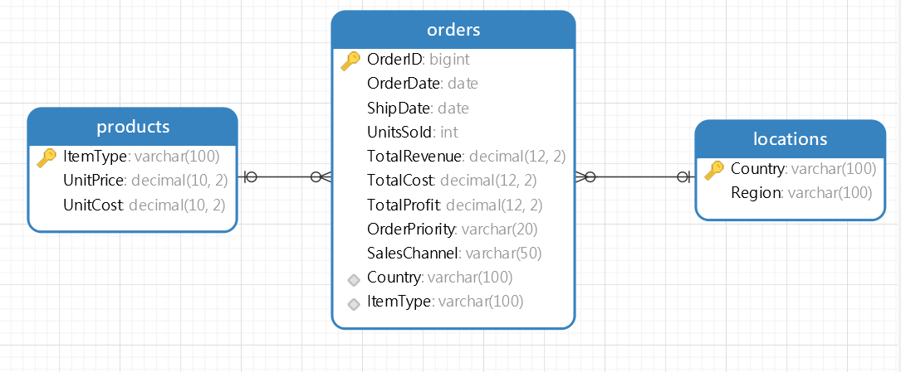

# About me
Greetings! I'm Ngan Ha, and welcome to my portfolio.

I am innovative and action-oriented senior student at RMIT University Vietnam, majoring in Business (Economics and Finance).

I am passionate about analyzing different data types, uncovering insights, and presenting them through beautiful visuals.

# Contents
  
<!-- TOC -->

- [About me](#about-me)
- [Contents](#contents)
- [Portfolio Description](#portfolio-description)
  - [SQL Analysis](#sql-analysis)
  - [Power BI (Dax and Dashboards Visualization)](#power-bi-dax-and-dashboards-visualization)
  - [Excel Reports](#excel-reports)
    - [Mondelēz International's Expansion in Philippines](#mondelēz-internationals-expansion-in-philippines)
    - [PNJ's Stock Investment Analysis](#pnjs-stock-investment-analysis)
  - [R Reports](#r-reports)
    - [Time Series Analysis of Germany's Monthly Mean Temperature (1991-2021) and Forecasting](#time-series-analysis-of-germanys-monthly-mean-temperature-1991-2021-and-forecasting)
    - [Time Series Analysis and Forecasting of Aluminum Prices (1992-2022)](#time-series-analysis-and-forecasting-of-aluminum-prices-1992-2022)

<!-- /TOC -->

# Portfolio Description

This portfolio showcases my data analysis and visualization skills using SQL, Power BI, Excel, and R. The projects cover a wide range of topics, including sales analysis, customer satisfaction, retail performance, forecasting and quantitative analysis.

## SQL Analysis

Dataset: [Amazon Sales Database](Datasets/AmazonSalesData.csv)

The schema of the Amazon sales database is shown below:

The `AmazonSales.sql` script includes various queries to analyze sales data from the `Orders`, `Products` and `Locations` tables.

## Power BI (Dax and Dashboards Visualization)

- **Customer Satisfaction.pbix**: 
  - Visualized interactive Power BI dashboard to keep track customer satisfaction (waiting time, dining purpose, dining frequency, loyalty members...) and rating at a restaurant using `COUNTROWS` 

- **Ecommerce Sales Analysis.pbix**: 
  - Visualized interactive Power BI dashboard to provide insights into e-commerce sales performance

- **Retail Analysis.pbix**: 
  - Showcased 3 interactive Power BI dashboards to visualize and track store sales, district monthly sales and new store analysis using DAX `SUM`, `DISTINCTCOUNT`, `DIVIDE`, `COUNTA` 

## Excel Reports
### Mondelēz International's Expansion in Philippines

Excel File: [Mondelēz International's Expansion in Philippines](Datasets/Mondelēz%20International's%20Expansion%20in%20Philippines.xlsx)

Report: [Mondelēz International's Expansion in Philippines Report](Reports/Mondelēz%20International's%20Expansion%20in%20Philippines.pdf)

Description:
- Implemented calculations of 3K+ macro and exchange rates data to result in model’s independent variables
- Performed deep dive analysis using regression macro-based model to explore the variables’ impact on changes in PHP/USD, VND/USD and predicted currencies pair using `FORECAST.ETS`
- Calculated WACC, NPV, IRR to measure project’s financial value, purchased forward contracts to mitigate currency exchange risks

### PNJ's Stock Investment Analysis

Excel File: [PNJ's Stock Investment Analysis](Datasets/PNJ's%20Stock%20Investment%20Analysis.xlsx)

Report: [PNJ's Stock Investment Analysis Report](Reports/PNJ's%20Stock%20Investment%20Analysis.pdf)

Description:
- Gathered data from +25 PNJ’s company reports and Refinitiv Eikon
- Developed assumptions to predict +33 financial statistics types
- Visualized 37 graphs and 12 tables using Pivot Chart and Pivot Table
- Conducted calculations for CAPM and DCF-FCFE Model
  

## R Reports

### Time Series Analysis of Germany's Monthly Mean Temperature (1991-2021) and Forecasting

Dataset: [Germany Monthly Mean Temperature Data](Datasets/Germany's%20Monthly%20Mean%20Temperature%20(1991-2021).xlsx)

Report: [Part A - Time Series Analysis of Germany's Monthly Mean Temperature (1991-2021) and Forecasting](Reports/Germany's%20Monthly%20Temperature%20and%20Aluminium%20Prices%20Forecasting%20and%20Quantitative%20Analysis.pdf)

Code: [Germany's Monthly Mean Temperature Analysis and Forecasting](./Germany's%20Monthly%20Mean%20Temperature%20Analysis%20and%20Forecasting.R)

- **Data Import and Preparation:**
  - Utilized R packages: `fpp2`, `fpp3`, `tsibble`, `tsfeatures`, `readxl` and `moments`
  - Imported monthly mean temperature data and converted it into time series and tsibble formats for analysis

- **Descriptive Statistics and Normality Assessment:**
  - Calculated key statistics: mean, median, mode, range, standard deviation, variance, and coefficient of variation
  - Detected outliers using the Interquartile Range (IQR) method
  - Evaluated data normality through Q-Q plots, histograms and skewness calculations

- **Time Series Visualization and Decomposition:**
  - Plotted the time series data to observe trends and patterns
  - Generated ACF and PACF plots to analyze autocorrelations
  - Performed Seasonal-Trend Decomposition (STL) to separate trend, seasonal and residual components
  - Created seasonal plots to examine recurring patterns over time

- **Stationarity Testing and Differencing:**
  - Conducted stationarity tests using the KPSS test, `nsdiffs` and `ndiffs`
  - Applied seasonal differencing to achieve stationarity in the time series data
  - Reassessed stationarity post-differencing and updated ACF and PACF plots

- **ARIMA Modeling and Forecasting:**
  - Proposed multiple ARIMA models
  - Selected the optimal model based on AICc and BIC
  - Performed residual diagnostics using the Ljung-Box test and residual plots
  - Forecasted monthly mean temperatures for the next 10 years (2022-2032) using the selected ARIMA model
  - Visualized the forecast results with prediction intervals to assess uncertainty

### Time Series Analysis and Forecasting of Aluminum Prices (1992-2022)

Dataset: [Aluminum Prices Data](Datasets/Aluminum%20Prices%20(1992-2022).xlsx)

Report: [Part B - Time Series Analysis of Aluminum Prices (1992-2022) and Forecasting](Reports/Germany's%20Monthly%20Temperature%20and%20Aluminium%20Prices%20Forecasting%20and%20Quantitative%20Analysis.pdf)

Code: [Aluminum Prices Analysis and Forecasting](./Aluminum%20Prices%20Analysis%20and%20Forecasting.R)

- **Data Import and Preparation:**
  - Utilized R packages: `fpp2`, `fpp3`, `tsibble`, `tsfeatures`, `readxl`, and `moments`
  - Imported monthly aluminum spot price data from 1992 to 2022
  - Converted the data into time series and tsibble formats for analysis

- **Data Visualization and Decomposition:**
  - Plotted the time series to observe trends and patterns in aluminum prices
  - Performed Seasonal-Trend Decomposition (STL) to separate the series into trend, seasonal, and residual components
  - Identified and visualized outliers in the data

- **Outlier Detection and Treatment:**
  - Detected outliers using the Interquartile Range (IQR) method on the remainder component of the decomposition
  - Replaced outliers with interpolated values using ARIMA modeling to maintain data continuity
  - Visualized the adjusted time series after outlier treatment

- **Model Selection and Evaluation:**
  - Split the data into training and test sets to validate model performance
  - Fitted several forecasting models including:
    - Mean method
    - Naïve method
    - ETS models: ANN (Additive error, No trend, No seasonality) and AAN (Additive error, Additive trend, No seasonality)
    - Combination of ETS models (average of ANN and AAN)
  - Evaluated models using accuracy metrics like MASE (Mean Absolute Scaled Error)
  - Selected the ETS (AAN) model as the best-performing model based on lowest MASE

- **Forecasting Future Prices:**
  - Generated forecasts for the next 12 months (2023-2024) using the selected ETS (AAN) model
  - Visualized the forecasted aluminum prices alongside historical data
  - Predicted prices for the year 2024

- **Residual Analysis:**
  - Performed residual diagnostics on all fitted models to assess their adequacy
  - Used residual plots to check for remaining underlying patterns, ensuring randomness and absence of autocorrelation
  
